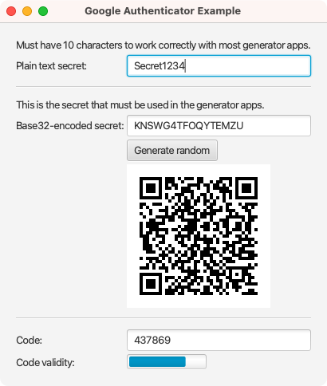

# Kotlin One-Time Password Library

This is a Kotlin library to generate one-time password codes for:

* Google Authenticator
* Time-Based One-Time Password (TOTP)
* HMAC-Based One-Time Password (HOTP)

The implementations are based on the RFCs:

* [RFC 4226: "RFC 4226 HOTP: An HMAC-Based One-Time Password Algorithm"](https://www.ietf.org/rfc/rfc4226.txt)
* [RFC 6238: "TOTP: Time-Based One-Time Password Algorithm"](https://tools.ietf.org/html/rfc6238)

> ℹ️ In this repository, changes don't happen that often and the library gets updated very rarely. However, this is **not** an abandoned project. Since the code is relatively simple, follows the specifications of the two RFCs, and has good test coverage, there is hardly any need to change anything.

> ℹ️ If you want to use this library in conjunction with the Google Authenticator app (or similar apps), please carefully read the chapter [Google Authenticator](#google-authenticator), especially the remarks regarding the Base32-encoded secret and the plain text secret length limitation. Most problems arise from not following the two remarks correctly.
> 
> This library gets used by hundreds of active users every day to generate Google Authenticator codes for several years now, so I am very confident that the code correctly generates codes.

## Dependency

This library is available at [Maven Central](https://mvnrepository.com/artifact/dev.turingcomplete/kotlin-onetimepassword):

### Gradle

```java
// Groovy
implementation 'dev.turingcomplete:kotlin-onetimepassword:2.2.0'

// Kotlin
implementation("dev.turingcomplete:kotlin-onetimepassword:2.2.0")
```

### Maven

```xml
<dependency>
    <groupId>dev.turingcomplete</groupId>
    <artifactId>kotlin-onetimepassword</artifactId>
    <version>2.2.0</version>
</dependency>
```

## Usage

### General Flow

```
             (1) Shared secret
  /‾‾‾‾‾‾‾‾‾‾‾‾‾‾‾‾‾‾‾‾‾‾‾‾‾‾‾‾‾‾‾‾‾‾‾‾‾‾‾\
User                                    Server
   <------------- Challenge ------------ (2)
 (3) ----- One-time password (Code) ----->
```

1. The user and server need to agree on a **shared secret**, which must be negotiated in advance and remains constant over a longer time.
2. The user now wants to authenticate to the server. For that, he could send the shared secret directly to the server (like a regular password), but a [man-in-the-middle attack](https://en.wikipedia.org/wiki/Man-in-the-middle_attack) could capture this, and the attacker could log in with the password. Instead, the server sends the user a **challenge** that he can only solve if he has the correct shared secret. (This step is optional if the generation algorithm of the challenge is known to both sides. For example, the Google authenticator uses the current Unix timestamp as a challenge.)
3. The solution to the challenge is a numeric **code.** This code also has the name **one-time-password**, as it only can be used once. Even if an attacker captures the code, he can't use it a second time to log in himself.

#### Implementation

The client of the user and the server must use the same code generator with the same configuration (e.g., number of code digits, hash algorithm). 

If the one-time-password is used for two-factor authentication, a possible HTTP flow could look like this (even if it does not follow an official standardization):

1. The client sends an HTTP request with the header for the normal login credentials ```Authorization: Basic Base64($username:$password)``` to the server.
2. If a two-factor authentication activate for the user, the server answers with HTTP status code ```401 Unauthorized``` and the header ```WWW-Authenticate: authType="2fa"```. The value for ```authType``` can also be made more specific to tell the client which generator should be used (e.g. _HOTP_, _TOTP_ or _Google_). If the challenge generation is unknown in advance, this value must be transferred by appending to the header value ```, challenge="$challenge"``` (yes, with the comma). 
3. The client then sends the usual login credentials header and the additional header ```Authorization: 2FA $code``` (or a more specific generator name instead of "2FA").

#### Number of Code Digits

All three one-time password generators create a code value with a fixed length given by the code digits property in the configuration instance. The computed code gets filled with zeros at the beginning to meet this requirement. This filling is the reason why the code gets represented as a String. The RFC 4226 requires a code digits value between 6 and 8 to assure a good security trade-off. However, this library does not set any requirements for this property. But notice that through the design of the algorithm, the maximum code value is 2,147,483,647. This maximum value means that a higher code digits value than ten adds more trailing zeros to the code (in the case of 10 digits, the first number is always 0, 1, or 2).

### HMAC-based One-time Password (HOTP)

The HOTP generator is available through the class ```HmacOneTimePasswordGenerator```.  The constructor takes the shared secret and a configuration instance of the class ```HmacOneTimePasswordConfig``` as arguments:

```kotlin
val secret = "Leia"
val config = HmacOneTimePasswordConfig(codeDigits = 8, 
                                       hmacAlgorithm = HmacAlgorithm.SHA1)
val hmacOneTimePasswordGenerator = HmacOneTimePasswordGenerator(secret.toByteArray(), config)
```

The configuration instance takes the number of code digits to be generated (see the previous chapter) and the HMAC algorithm to be used (SHA1, SHA256, and SHA512 are available).

The method ```generate(counter: Int)``` can now be used on an instance of the generator to create a HOTP code:

```kotlin
var code0: String = hmacOneTimePasswordGenerator.generate(counter = 0)
var code1: String = hmacOneTimePasswordGenerator.generate(counter = 1)
var code2: String = hmacOneTimePasswordGenerator.generate(counter = 2)
...
```

There is also a helper method ```isValid(code: String, counter: Int)``` available in the generator's instance to validate the received code possible in one line.

### Time-based One-time Password (TOTP)

The TOTP generator is available through the class ```TimeBasedOneTimePasswordGenerator```. Its constructor takes the shared secret and a configuration instance of the class ```TimeBasedOneTimePasswordConfig``` as arguments:

```kotlin
val secret = "Leia"
val config = TimeBasedOneTimePasswordConfig(codeDigits = 8, 
                                            hmacAlgorithm = HmacAlgorithm.SHA1,
                                            timeStep = 30, 
                                            timeStepUnit = TimeUnit.SECONDS)
val timeBasedOneTimePasswordGenerator = TimeBasedOneTimePasswordGenerator(secret.toByteArray(), config)
```

As well as the HOTP configuration, the TOTP configuration takes the number of code digits and the HMAC algorithm as arguments (see the previous chapter). Additionally, the time window in which the generated code is valid is represented through the arguments timeStep and time step unit. The default value of the timestamp is the current system time

The methods ```generate(timestamp: Long)```, ```generate(date: Date)``` and ```generate(instant: Instant)``` can now be used on the generator instance to generate a TOTP code:

```kotlin
var code0: String = timeBasedOneTimePasswordGenerator.generate() // Will use System.currentTimeMillis()
var code1: String = timeBasedOneTimePasswordGenerator.generate(timestamp = 1622234248000L)
var code2: String = timeBasedOneTimePasswordGenerator.generate(date = java.util.Date(59)) // Will internally call generate(timestamp = date.time)
var code3: String = timeBasedOneTimePasswordGenerator.generate(instant = java.time.Instant.ofEpochSecond(1622234248L)) // Will internally call generate(timestamp = instante.toEpochMillis())
...
```

Again, there is a helper method ```isValid(code: String, timestamp: Date)``` available in the instance of the generator, to make the validation of the received code possible in one line.

There is also a helper method for calculating the time slot (counter) from a given timestamp, `Date`, or `Instant`.
```kotlin
var counter0: Long = timeBasedOneTimePasswordGenerator.counter() // Will use System.currentTimeMillis()
var counter1: Long = timeBasedOneTimePasswordGenerator.counter(timestamp = 1622234248000L)
var counter2: Long = timeBasedOneTimePasswordGenerator.counter(date = java.util.Date(59)) // Will internally call counter(timestamp = date.time)
var counter3: Long = timeBasedOneTimePasswordGenerator.counter(instant = java.time.Instant.ofEpochSecond(1622234248L)) // Will internally call counter(timestamp = instante.toEpochMillis())
...
```

You can use this counter to calculate the start and the end of a timeslot and with this how long your TOTP is still valid.
```kotlin
val timestamp = instant.toEpochMillis()
val totp = timeBasedOneTimePasswordGenerator.generate(timestamp)
val counter = timeBasedOneTimePasswordGenerator.counter()
val startEpochMillis = timeBasedOneTimePasswordGenerator.timeslotStart(counter)
//basically the start of next time slot minus 1ms
val endEpochMillis = timeBasedOneTimePasswordGenerator.timeslotStart(counter+1)-1
//number of milliseconds the current TOTP is still valid
val millisValid = endEpochMillis - timestamp
```
### Google Authenticator

##### The "Google Way"

Some TOTP generators use the "Google way" to generate codes. This slightly different behavior means that the generator works internally with the plain text secret, **but the secret gets passed around as Base32-encoded**. (Confusing the plain text and the Base32-encoded secret in the different steps is the most common reason people think the Google Authenticator with this library doesn't work.)

The Google Authenticator generator is available through the class ```GoogleAuthenticator```. It is a decorator for the TOTP generator with a fixed code digits value of 6, SHA1 as HMAC algorithm, and a time window of 30 seconds. The constructor only takes **the Base32-encoded secret** as an argument:

```kotlin
// Warning: the length of the plain text may be limited, see next chapter
val plainTextSecret = "Secret1234".toByteArray(Charsets.UTF_8)

// This is the encoded one to use in most of the generators (Base32 is from the Apache commons codec library)
val base32EncodedSecret = Base32().encodeToString(plainTextSecret)
println("Base32 encoded secret to be used in the Google Authenticator app: $base32EncodedSecret")

val googleAuthenticator = GoogleAuthenticator(secret = base32EncodedSecret)
var code = googleAuthenticator.generate() // Will use System.currentTimeMillis()
```

See the TOTP generator for the code generation ```generator(timestamp: Date)``` and validation ```isValid(code: String, timestamp: Date)``` methods.

There is also a helper method ```GoogleAuthenticator.createRandomSecretAsByteArray()```, that will return a 16-byte Base32-encoded random secret.

(Note that the Base32-encoding of the secret is just a wrapper to the outside world. Hence, the `TimeBasedOneTimePasswordGenerator` internally still works with the non-encoded plain secret.)

#### Secret Length Limitation

Some generators limit the length of the **plain text secret** or set a fixed number of characters. So the "Google way", which has a fixed value of 10 characters. Anything outside this range will not be handled correctly by some generators.


#### QR Code

QR codes must use a URI that follows the definition in [Key Uri Format](https://github.com/google/google-authenticator/wiki/Key-Uri-Format). The secret in this URI is the Base32-encoded one.


#### Simulate the Google Authenticator

The directory ```example/googleauthenticator``` contains a simple JavaFX application to simulate the Google Authenticator:




Alternatively, you can use the following code to simulate the Google Authenticator on the command line. It prints a valid code for the secret `K6IPBHCQTVLCZDM2` every second.
```kotlin
fun main() {
  val base32Secret = "K6IPBHCQTVLCZDM2"

  Timer().schedule(object: TimerTask() {
    override fun run() {
      val timestamp = Date(System.currentTimeMillis())
      val code = GoogleAuthenticator(base32Secret).generate(timestamp)
      println("${SimpleDateFormat("HH:mm:ss").format(timestamp)}: $code")
    }
  }, 0, 1000)
}
```

### Random Secret Generator

RFC 4226 recommends using a secret of the same length as the hash produced by the HMAC algorithm. The class ```RandomSecretGenerator``` can be used to generate such random shared secrets:

```kotlin
val randomSecretGenerator = RandomSecretGenerator()

val secret0: ByteArray = randomSecretGenerator.createRandomSecret(HmacAlgorithm.SHA1) // 20-byte secret
val secret1: ByteArray = randomSecretGenerator.createRandomSecret(HmacAlgorithm.SHA256) // 32-byte secret
val secret2: ByteArray = randomSecretGenerator.createRandomSecret(HmacAlgorithm.SHA512) // 64-byte secret
val secret3: ByteArray = randomSecretGenerator.createRandomSecret(1234) // 1234-byte secret
```

## Licensing


Copyright (c) 2022 Marcel Kliemannel

Licensed under the **Apache License, Version 2.0** (the "License"); you may not use this file except in compliance with the License.

You may obtain a copy of the License at <https://www.apache.org/licenses/LICENSE-2.0>.

Unless required by applicable law or agreed to in writing, software distributed under the License is distributed on an "AS IS" BASIS, WITHOUT WARRANTIES OR CONDITIONS OF ANY KIND, either express or implied. See the [LICENSE](./LICENSE) for the specific language governing permissions and limitations under the License.
