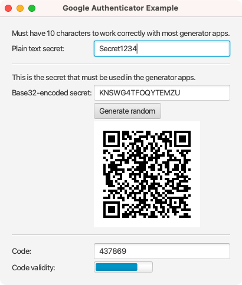

# Kotlin One-Time Password Library

This Kotlin library generates one-time password codes for:

* Google Authenticator
* Time-Based One-Time Password (TOTP)
* HMAC-Based One-Time Password (HOTP)

The implementations are based on:

* [RFC 4226: "HOTP: An HMAC-Based One-Time Password Algorithm"](https://www.ietf.org/rfc/rfc4226.txt)
* [RFC 6238: "TOTP: Time-Based One-Time Password Algorithm"](https://tools.ietf.org/html/rfc6238)

> [!NOTE]  
> This library is updated rarely, but that does not mean it is abandoned. The implementation is small, follows the relevant RFCs, and has good test coverage, so there is usually little reason to change it.

> [!TIP]
> If you want to use this library with the Google Authenticator app or compatible apps, read [Google Authenticator](#google-authenticator) carefully, especially the notes about Base32-encoded secrets and plain-text secret length. Most integration problems come from mixing up those two details.
>
> This library has generated Google Authenticator-compatible codes for hundreds of active users every day for several years.

## Table of Contents

- [Dependency](#dependency)
  - [Gradle](#gradle)
  - [Maven](#maven)
- [Usage](#usage)
  - [General Flow](#general-flow)
    - [Implementation](#implementation)
    - [Number of Code Digits](#number-of-code-digits)
  - [HMAC-based One-time Password (HOTP)](#hmac-based-one-time-password-hotp)
  - [Time-based One-time Password (TOTP)](#time-based-one-time-password-totp)
  - [Google Authenticator](#google-authenticator)
    - [The "Google Way"](#the-google-way)
    - [Secret Length Limitation](#secret-length-limitation)
    - [Simulate the Google Authenticator](#simulate-the-google-authenticator)
  - [Random Secret Generator](#random-secret-generator)
  - [Key URI Format for QR Codes](#key-uri-format-for-qr-codes)
- [Licensing](#licensing)

## Dependency

The library is available from [Maven Central](https://mvnrepository.com/artifact/dev.turingcomplete/kotlin-onetimepassword):

### Gradle

```java
// Groovy
implementation 'dev.turingcomplete:kotlin-onetimepassword:2.4.1'

// Kotlin
implementation("dev.turingcomplete:kotlin-onetimepassword:2.4.1")
```

### Maven

```xml
<dependency>
    <groupId>dev.turingcomplete</groupId>
    <artifactId>kotlin-onetimepassword</artifactId>
    <version>2.4.1</version>
</dependency>
```

## Usage

### General Flow

```text
             (1) Shared secret
  /‾‾‾‾‾‾‾‾‾‾‾‾‾‾‾‾‾‾‾‾‾‾‾‾‾‾‾‾‾‾‾‾‾‾‾‾‾‾‾\
User                                    Server
   <------------- Challenge ------------ (2)
 (3) ----- One-time password (Code) ----->
```

1. The user and server agree on a **shared secret** in advance. The shared secret remains stable over time.
2. When the user authenticates, the server can send a **challenge** that can only be solved with the correct shared secret. This step is optional when both sides already know how to derive the challenge. For example, Google Authenticator-compatible TOTP uses the current Unix timestamp.
3. The solution is a numeric **code**, also called a **one-time password**. The code is valid only once. If an attacker captures it, they cannot use the same code again later.

#### Implementation

The user's client and the server must use the same generator and configuration, including the number of code digits and the HMAC algorithm.

If the one-time password is used for two-factor authentication, an HTTP flow could look like this. This is only an example and does not describe an official standard:

1. The client sends the normal login credentials, for example with `Authorization: Basic Base64($username:$password)`.
2. If two-factor authentication is enabled for the user, the server responds with `401 Unauthorized` and a header such as `WWW-Authenticate: authType="2fa"`. The `authType` value can be more specific, such as `HOTP`, `TOTP`, or `Google`. If the client does not know how to derive the challenge, the server can append it to the header value as `, challenge="$challenge"`.
3. The client sends the normal login credentials again, plus the generated code, for example with `Authorization: 2FA $code` or a more specific generator name instead of `2FA`.

#### Number of Code Digits

All three generators create fixed-length codes. The length is defined by the `codeDigits` property in the configuration. If the computed code is shorter than that length, it is padded with leading zeroes. Because leading zeroes are significant, generated codes are returned as `String` values.

RFC 4226 recommends 6 to 8 digits as a good security trade-off. By default, this library requires at least 6 digits and rejects values above 9, because larger values do not add useful security with the RFC dynamic truncation result.

If you need to reproduce legacy test vectors or interoperate with an insecure legacy deployment, shorter code lengths can be enabled explicitly:

```kotlin
val config = HmacOneTimePasswordConfig(codeDigits = 4,
                                       hmacAlgorithm = HmacAlgorithm.SHA1,
                                       allowInsecureConfiguration = true)
```

### HMAC-based One-time Password (HOTP)

The HOTP generator is provided by `HmacOneTimePasswordGenerator`. Its constructor takes the shared secret and an `HmacOneTimePasswordConfig`:

```kotlin
val secret = "Leia"
val config = HmacOneTimePasswordConfig(codeDigits = 8, 
                                       hmacAlgorithm = HmacAlgorithm.SHA1)
val hmacOneTimePasswordGenerator = HmacOneTimePasswordGenerator(secret.toByteArray(), config)
```

The configuration defines the number of generated code digits and the HMAC algorithm. `SHA1`, `SHA256`, and `SHA512` are supported.

Use `generate(counter: Long)` to create a HOTP code:

```kotlin
var code0: String = hmacOneTimePasswordGenerator.generate(counter = 0)
var code1: String = hmacOneTimePasswordGenerator.generate(counter = 1)
var code2: String = hmacOneTimePasswordGenerator.generate(counter = 2)
...
```

Use `isValid(code: String, counter: Long)` to validate a received code in one call.

### Time-based One-time Password (TOTP)

The TOTP generator is provided by `TimeBasedOneTimePasswordGenerator`. Its constructor takes the shared secret and a `TimeBasedOneTimePasswordConfig`:

```kotlin
val secret = "Leia"
val config = TimeBasedOneTimePasswordConfig(codeDigits = 8, 
                                            hmacAlgorithm = HmacAlgorithm.SHA1,
                                            timeStep = 30, 
                                            timeStepUnit = TimeUnit.SECONDS)
val timeBasedOneTimePasswordGenerator = TimeBasedOneTimePasswordGenerator(secret.toByteArray(), config)
```

Like the HOTP configuration, the TOTP configuration defines the number of code digits and the HMAC algorithm. It also defines the time window in which a generated code is valid through `timeStep` and `timeStepUnit`. When no timestamp is passed to the generator, the current system time is used.

A zero-length time step would create a static counter and is rejected by default. If you must reproduce that legacy behavior, set `allowInsecureConfiguration = true` in `TimeBasedOneTimePasswordConfig`.

Use `generate(timestamp: Long)`, `generate(date: Date)`, or `generate(instant: Instant)` to create a TOTP code:

```kotlin
var code0: String = timeBasedOneTimePasswordGenerator.generate() // Will use System.currentTimeMillis()
var code1: String = timeBasedOneTimePasswordGenerator.generate(timestamp = 1622234248000L)
var code2: String = timeBasedOneTimePasswordGenerator.generate(date = java.util.Date(59)) // Will internally call generate(timestamp = date.time)
var code3: String = timeBasedOneTimePasswordGenerator.generate(instant = java.time.Instant.ofEpochSecond(1622234248L)) // Will internally call generate(timestamp = instant.toEpochMilli())
...
```

Use `isValid(code: String, timestamp: Date)` to validate a received code in one call.

There is also a helper method for calculating the time slot (counter) from a given timestamp, `Date`, or `Instant`.

```kotlin
var counter0: Long = timeBasedOneTimePasswordGenerator.counter() // Will use System.currentTimeMillis()
var counter1: Long = timeBasedOneTimePasswordGenerator.counter(timestamp = 1622234248000L)
var counter2: Long = timeBasedOneTimePasswordGenerator.counter(date = java.util.Date(59)) // Will internally call counter(timestamp = date.time)
var counter3: Long = timeBasedOneTimePasswordGenerator.counter(instant = java.time.Instant.ofEpochSecond(1622234248L)) // Will internally call counter(timestamp = instant.toEpochMilli())
...
```

You can use the counter to calculate the start and end of the current time slot, and therefore how long the current TOTP code remains valid.

```kotlin
val instant = java.time.Instant.ofEpochSecond(1622234248L)
val timestamp = instant.toEpochMilli()
val totp = timeBasedOneTimePasswordGenerator.generate(timestamp)
val counter = timeBasedOneTimePasswordGenerator.counter()
val startEpochMillis = timeBasedOneTimePasswordGenerator.timeslotStart(counter)
// The start of the next time slot minus 1 ms
val endEpochMillis = timeBasedOneTimePasswordGenerator.timeslotStart(counter + 1) - 1
// The number of milliseconds the current TOTP remains valid
val millisValid = endEpochMillis - timestamp
```

### Google Authenticator

#### The "Google Way"

Some TOTP generators use the "Google way" to generate codes. The generator works internally with the plain-text secret, **but the secret is passed around as Base32-encoded text**. Confusing the plain-text secret with the Base32-encoded secret is the most common reason Google Authenticator integrations fail.

The Google Authenticator generator is provided by `GoogleAuthenticator`. It wraps the TOTP generator with a fixed 6-digit code, `SHA1` as the HMAC algorithm, and a 30-second time window. Its constructor expects **the Base32-encoded secret**:

```kotlin
// Warning: the length of the plain-text secret may be limited. See the next section.
val plainTextSecret = "Secret1234".toByteArray(Charsets.UTF_8)

// This is the encoded value to use with Google Authenticator-compatible generators.
// Base32 is from the Apache Commons Codec library.
val base32EncodedSecret = Base32().encodeToString(plainTextSecret)
println("Base32 encoded secret to be used in the Google Authenticator app: $base32EncodedSecret")

val googleAuthenticator = GoogleAuthenticator(base32EncodedSecret)
var code = googleAuthenticator.generate() // Will use System.currentTimeMillis()
```

See the TOTP generator for timestamp-based code generation and validation methods.

`GoogleAuthenticator.createRandomSecretAsByteArray()` returns a Google Authenticator-compatible 16-character Base32-encoded random secret. This method intentionally preserves the historical Google Authenticator convention of a 10-byte, 80-bit plain-text secret.

For new deployments that do not require that historical Google-compatible secret size, prefer `GoogleAuthenticator.createSecureRandomSecretAsByteArray()`. It generates a 20-byte, 160-bit plain-text secret and returns it Base32-encoded.

Base32 encoding is only the external representation of the secret. Internally, `TimeBasedOneTimePasswordGenerator` still uses the decoded plain secret.

#### Secret Length Limitation

Some generators limit the length of the **plain-text secret** or expect a fixed size. The historical Google Authenticator-compatible setup uses a 10-byte plain secret, which becomes a 16-character Base32-encoded secret. Other secret sizes may not work correctly with every compatible app.

#### Simulate the Google Authenticator

The directory `example/googleauthenticator` contains a simple JavaFX application that simulates Google Authenticator:



Alternatively, use the following code to simulate Google Authenticator on the command line. It prints a valid code for the secret `K6IPBHCQTVLCZDM2` every second.

```kotlin
fun main() {
  val base32Secret = "K6IPBHCQTVLCZDM2"

  Timer().schedule(object: TimerTask() {
    override fun run() {
      val timestamp = Date(System.currentTimeMillis())
      val code = GoogleAuthenticator(base32Secret).generate(timestamp)
      println("${SimpleDateFormat("HH:mm:ss").format(timestamp)}: $code")
    }
  }, 0, 1000)
}
```

### Random Secret Generator

RFC 4226 recommends using a secret with the same length as the hash produced by the HMAC algorithm. Use `RandomSecretGenerator` to generate random shared secrets:

```kotlin
val randomSecretGenerator = RandomSecretGenerator()

val secret0: ByteArray = randomSecretGenerator.createRandomSecret(HmacAlgorithm.SHA1) // 20-byte secret
val secret1: ByteArray = randomSecretGenerator.createRandomSecret(HmacAlgorithm.SHA256) // 32-byte secret
val secret2: ByteArray = randomSecretGenerator.createRandomSecret(HmacAlgorithm.SHA512) // 64-byte secret
val secret3: ByteArray = randomSecretGenerator.createRandomSecret(1234) // 1234-byte secret
```

### Key URI Format for QR Codes

The [Key Uri Format](https://github.com/google/google-authenticator/wiki/Key-Uri-Format) specification defines a URI that contains the generator configuration. This URI can be embedded in a QR code, which makes OTP account setup easier and less error-prone.

This library provides `OtpAuthUriBuilder` to generate those URIs. For example:

```kotlin
OtpAuthUriBuilder.forTotp(Base32().encode("secret".toByteArray()))
  .label("John", "Company")
  .issuer("Company")
  .digits(8)
  .buildToString()
```

This generates:

```text
otpauth://totp/Company:John/?issuer=Company&digits=8&secret=ONSWG4TFOQ
```

All three generators provide `otpAuthUriBuilder()` to create an `OtpAuthUriBuilder` with the generator configuration already set. For example:

```kotlin
GoogleAuthenticator(Base32().encode("secret".toByteArray()))
  .otpAuthUriBuilder()
  .issuer("Company")
  .buildToString()
```

This generates:

```text
otpauth://totp/?algorithm=SHA1&digits=6&period=30&issuer=Company&secret=ONSWG4TFOQ
```

According to the specification, Base32 padding characters (`=`) are removed from the `secret` parameter. For example, the Base32-encoded secret for `foo` is `MZXW6===`, but the URI parameter value is `MZXW6`.

## Licensing

Copyright (c) 2024 Marcel Kliemannel

Licensed under the **Apache License, Version 2.0** (the "License"); you may not use this file except in compliance with the License.

You may obtain a copy of the License at <https://www.apache.org/licenses/LICENSE-2.0>.

Unless required by applicable law or agreed to in writing, software distributed under the License is distributed on an "AS IS" BASIS, WITHOUT WARRANTIES OR CONDITIONS OF ANY KIND, either express or implied. See the [LICENSE](./LICENSE) for the specific language governing permissions and limitations under the License.
